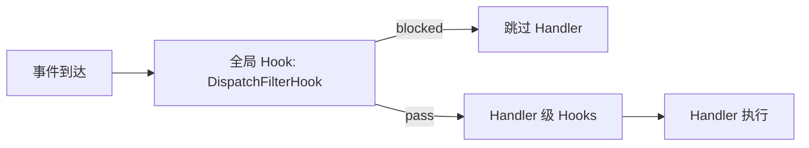

# Hook 系统参考

> 参考文档：`docs/docs/notes/guide/3. 插件开发/9. Hooks.md`、`docs/docs/notes/reference/4. 核心模块/`

## Hook 三阶段

| 阶段 | 枚举值 | 作用 | 可返回 |
|------|--------|------|--------|
| `BEFORE_CALL` | `HookStage.BEFORE_CALL` | handler 执行前，可跳过 | `CONTINUE` / `SKIP` |
| `AFTER_CALL` | `HookStage.AFTER_CALL` | handler 成功后 | `CONTINUE` |
| `ON_ERROR` | `HookStage.ON_ERROR` | handler 抛异常时 | `CONTINUE` |

同阶段按 `priority` **降序**执行（数字越大越先执行）。

## 内置 Hook 使用

```python
from ncatbot.core import registrar, add_hooks, group_only, private_only, non_self
from ncatbot.core import startswith, keyword, regex

# 预置单例
@group_only                        # priority=100
@non_self                          # priority=200
@registrar.on_message()
async def handler(self, event): ...

# 组合多个
@add_hooks(group_only, non_self)
@registrar.on_message()
async def handler(self, event): ...

# 文本匹配
@startswith("/")                   # priority=90
@registrar.on_group_message()
async def on_cmd(self, event): ...

@keyword("天气", "weather")         # priority=90
@registrar.on_group_message()
async def on_weather(self, event): ...

@regex(r"(\d+)\s*\+\s*(\d+)")     # priority=90，match 注入 kwargs
@registrar.on_group_message()
async def on_calc(self, event, match=None):
    a, b = int(match.group(1)), int(match.group(2))
    await event.reply(f"{a} + {b} = {a + b}")
```

## 命令参数自动绑定

**实现含参数命令时，建议使用自动参数绑定**，无需手动解析消息：

```python
# ✅ 推荐：自动参数绑定
@registrar.on_command("echo")
async def on_echo(self, event, content: str):
    """'echo 你好' → content='你好'"""
    await event.reply(text=f"🔊 {content}")

# ❌ 不推荐：手动解析
@registrar.on_command("echo-manual")
async def on_echo_manual(self, event):
    parts = event.raw_message.split(maxsplit=1)
    content = parts[1] if len(parts) > 1 else ""
    if not content:
        await event.reply("用法: echo-manual <内容>")
        return
    await event.reply(f"🔊 {content}")

# 更复杂的参数绑定
@registrar.on_group_command("add")
async def on_add(self, event, a: int, b: int):
    await event.reply(f"{a} + {b} = {a + b}")

@registrar.on_group_command("kick")
async def on_kick(self, event, target: At):
    await self.api.qq.manage.set_group_kick(event.group_id, target.qq)
```

### 执行流程

1. **预处理**：首个 `PlainText` 移到 index 0（解决 Reply 开头的消息匹配失败）
2. **匹配**：shlex 分词后首 token 匹配命令名即触发（统一前缀匹配）
3. **binding stream**：命令后剩余文本 + 后续段 → `[("token", str), ("at", At), ...]`
4. **绑定**：逐参数从 stream 中匹配，不匹配的段跳过（永久消耗）
5. **缺失**：必选参数缺失 → WARNING + 自动回复 usage + SKIP

### 参数绑定规则

| 类型注解 | 绑定来源 | 说明 |
|---------|---------|------|
| `At` | binding stream 中 kind="at" 的项 | 从消息段匹配 @ 对象 |
| `int` / `float` | binding stream 中 kind="token" 的项 | 自动类型转换，转换失败则跳过 |
| `str`（非最后参数） | binding stream 中 kind="token" 的项 | 消费一个 token |
| `str`（最后参数） | 剩余所有 kind="token" 的项 | 空格拼接 |
| 引号包裹 | shlex 分词 | `"hello world"` / `'foo bar'` 作为单个 token |
| 有默认值 | — | 缺失时使用默认值 |
| 必填且缺失 | — | WARNING + 回复用法说明 + SKIP |
| 段跳过 | — | 不匹配的段被永久消耗，不参与后续参数匹配 |

## 内置 Hook 完整清单

### 过滤器（BEFORE_CALL）

| Hook 类 | 构造参数 | 优先级 | 说明 |
|---------|---------|--------|------|
| `MessageTypeFilter(type)` | `"group"` \| `"private"` | 100 | 消息类型过滤 |
| `PostTypeFilter(type)` | `"message"` \| `"notice"` \| `"request"` \| `"meta_event"` | 100 | 事件大类过滤 |
| `SubTypeFilter(sub_type)` | `str` | 100 | 子类型过滤 |
| `SelfFilter()` | — | 200 | 过滤自己消息 |
| `NoticeTypeFilter(type)` | `"group_increase"` 等 | 100 | 通知类型过滤 |
| `RequestTypeFilter(type)` | `"friend"` \| `"group"` | 100 | 请求类型过滤 |

### 匹配器（BEFORE_CALL）

| Hook 类 | 构造参数 | 优先级 | 说明 |
|---------|---------|--------|------|
| `StartsWithHook(prefix)` | `str` | 90 | 前缀匹配 |
| `KeywordHook(*words)` | `str...` | 90 | 关键词（任一命中） |
| `RegexHook(pattern, flags)` | `str`, `int = 0` | 90 | 正则，`ctx.kwargs["match"]` |
| `CommandHook(*names, ignore_case)` | `str...`, `bool = False` | 95 | 命令 + 参数绑定 |

## 自定义 Hook

```python
from ncatbot.core import Hook, HookStage, HookAction, HookContext

class CooldownHook(Hook):
    stage = HookStage.BEFORE_CALL
    priority = 80

    def __init__(self, seconds: float = 5.0):
        self._seconds = seconds
        self._last_use: dict[str, float] = {}

    async def execute(self, ctx: HookContext) -> HookAction:
        import time
        user_id = getattr(ctx.event.data, "user_id", None)
        if user_id is None:
            return HookAction.CONTINUE
        now = time.time()
        last = self._last_use.get(user_id, 0)
        if now - last < self._seconds:
            return HookAction.SKIP
        self._last_use[user_id] = now
        return HookAction.CONTINUE
```

**HookContext 字段**：

| 字段 | 类型 | 说明 |
|------|------|------|
| `event` | `Event` | 原始事件 |
| `event_type` | `str` | 事件类型 |
| `handler_entry` | `HandlerEntry` | handler 信息 |
| `api` | `BotAPIClient` | API 客户端 |
| `services` | `Optional[ServiceManager]` | 服务管理器 |
| `kwargs` | `Dict[str, Any]` | 注入参数 |
| `result` | `Any` | handler 结果（AFTER_CALL） |
| `error` | `Optional[Exception]` | 异常（ON_ERROR） |

## CommandGroupHook — 分层命令

> 参考文档：`docs/docs/notes/reference/4. 核心模块/3. 注册表.md`
> 完整示例：`docs/docs/examples/common/08_command_group/`

将命令按组织结构分层，支持 `/admin kick <uid>` 形式的子命令路由。

### 导入

```python
from ncatbot.core import CommandGroupHook, registrar
```

### 构造

```python
# CommandGroupHook(*names, ignore_case=False)
admin_hook = CommandGroupHook("admin", "/admin", "a", ignore_case=True)
calc_hook = CommandGroupHook("calc")
```

- `*names`：命令名（多个为别名），匹配消息首个 token
- `ignore_case`：是否忽略大小写

### 注册子命令

```python
@admin_hook.subcommand("kick", "remove")  # 子命令名（多个为别名）
async def admin_kick(self, event: GroupMessageEvent, user_id: int):
    await event.api.manage.set_group_kick(event.group_id, user_id)
    await event.reply(f"已踢出 {user_id}")

@admin_hook.subcommand("ban")
async def admin_ban(self, event: GroupMessageEvent, user_id: int, minutes: int = 60):
    await event.api.manage.set_group_ban(event.group_id, user_id, duration=minutes * 60)
    await event.reply(f"已禁言 {user_id} {minutes} 分钟")
```

子命令参数类型绑定规则与 CommandHook 一致（见上方"命令参数自动绑定"）。

### 主 handler 分发

```python
@registrar.on_group_message()
@admin_hook
async def on_admin(self, event: GroupMessageEvent, **kwargs):
    """CommandGroupHook 自动匹配子命令并注入参数到 kwargs"""
    # 在主 handler 中根据子命令名分发到对应子命令方法
    ...
```

### 与 CommandHook 的区别

| 特性 | CommandHook | CommandGroupHook |
|------|-------------|------------------|
| 结构 | 单层命令 | 命令 + 子命令 |
| 匹配 | `/cmd args` | `/cmd subcmd args` |
| 注册方式 | `@registrar.on_*_command()` | `@hook.subcommand()` + `@hook` 装饰器 |
| 参数绑定 | ✅ | ✅（子命令级别） |

## 执行顺序示例

```python
@add_hooks(
    non_self,            # priority=200，最先
    group_only,          # priority=100
    keyword("天气"),      # priority=90
    CooldownHook(5.0),   # priority=80，最后
)
@registrar.on_message()
async def handler(self, event):
    # 不是自己发的 → 群消息 → 包含"天气" → 未在冷却中
    ...
```

## 全局 Hook — DispatchFilterHook

> 参考文档：`docs/docs/notes/reference/6. 服务层/3. 分发过滤服务.md`

`DispatchFilterHook` 是一种**全局 Hook**，通过 `HandlerDispatcher(global_hooks=[...])` 注册，在所有 handler 的 handler 级 hooks 之前执行。

- **priority**: 200
- **stage**: `BEFORE_CALL`
- **依赖**: `DispatchFilterService`

插件开发者**不需要**手动使用 `DispatchFilterHook`，通过 `DispatchFilterMixin` 管理规则即可自动生效。


