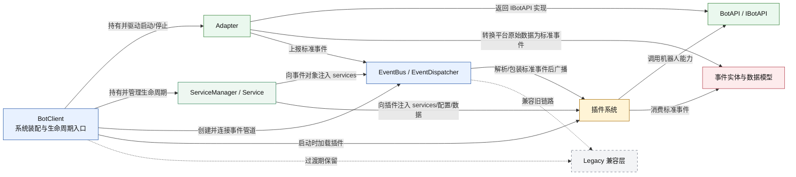
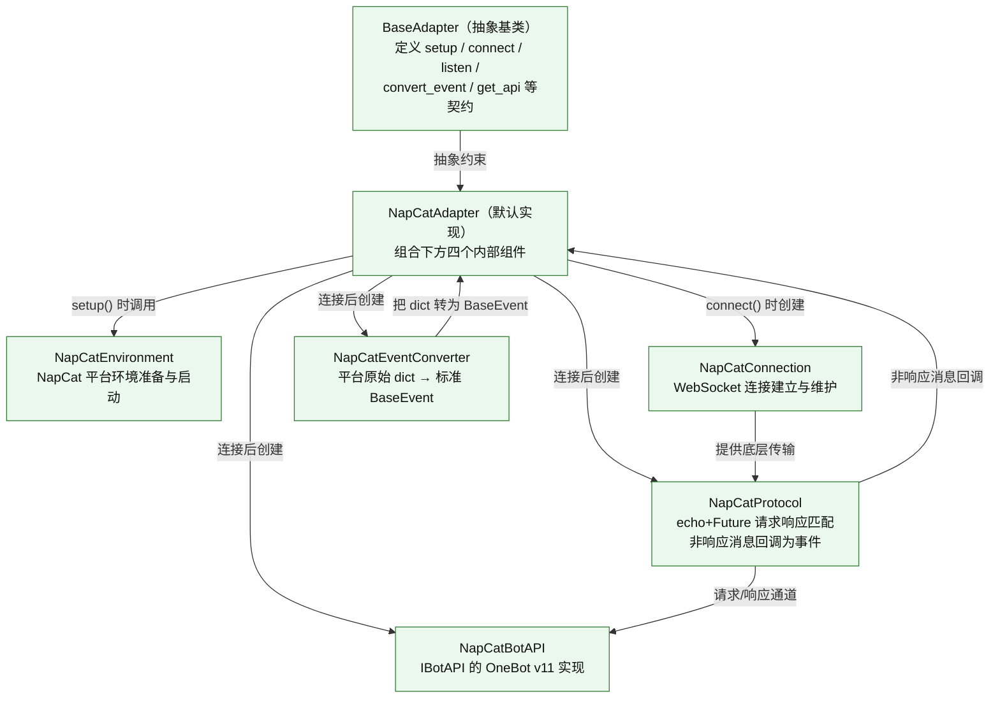
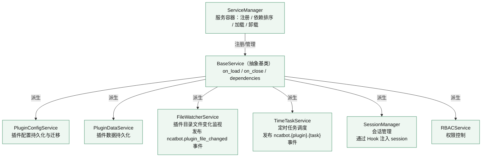
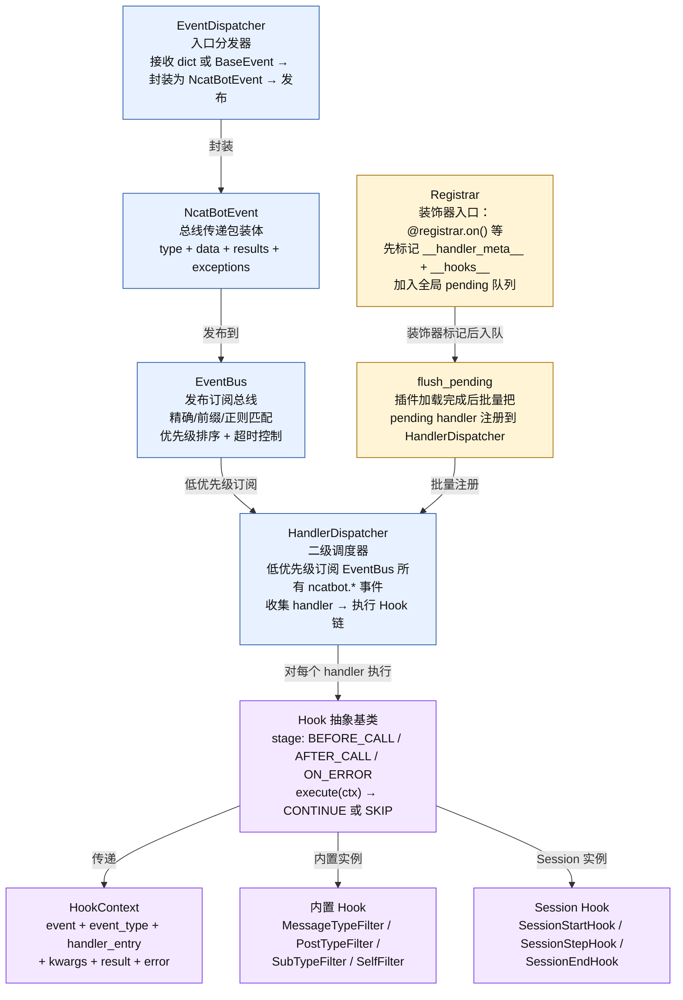
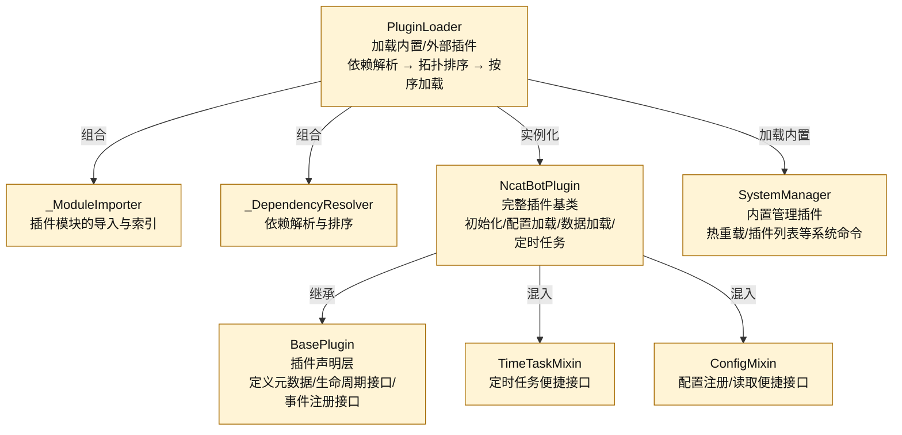
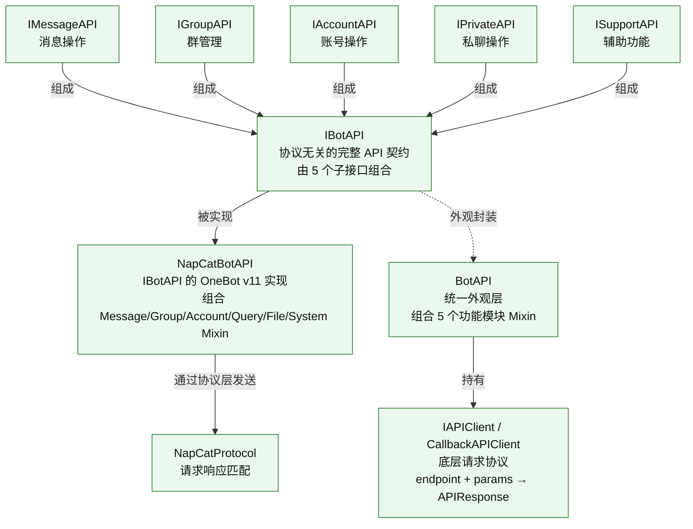
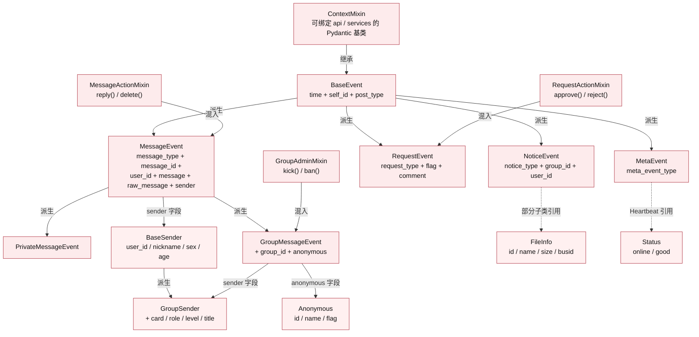
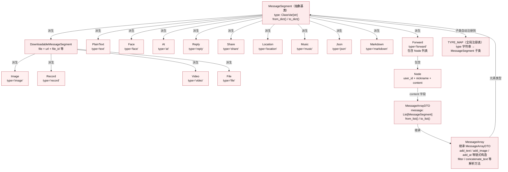

# NcatBot 架构图

本文档包含两部分：

1. **顶层模块关系图** —— 把各子系统视为原子，只展示模块间依赖与数据流向。
2. **各模块内部图** —— 逐个展开每个子系统的内部构成与核心关系，并说明与外部模块的交互。

---

## 一、顶层模块关系图

**读图说明**

- **BotClient** 是整个系统的装配入口（`core/client/client.py`），负责创建并持有其余所有子系统。
- **Adapter** 负责与外部平台交互（连接、监听、事件转换、API 实现），产出的标准事件通过 **EventBus/EventDispatcher** 广播给消费方。
- **ServiceManager** 管理所有 Service 的生命周期，并将能力注入到事件对象和插件中。
- **插件系统** 是业务逻辑的承载层，通过 EventBus 消费事件、通过 IBotAPI 调用机器人能力。
- **事件实体与数据模型** 是系统的通用数据语言，Adapter 产出它们、插件消费它们。
- **Legacy 兼容层** 仅用于过渡期，不参与新架构主链。

---

## 二、各模块内部图

### 2.1 Adapter 模块

**说明**

- `BaseAdapter`（`adapter/base.py`）是所有适配器的抽象基类，声明五大生命周期方法和事件转换契约。
- `NapCatAdapter`（`adapter/napcat/adapter.py`）是当前唯一实现，内部组合环境准备、连接管理、协议层、事件转换器和 API 实现五个组件。
- **与外部模块的交互**：
  - Adapter 上报的 `BaseEvent` 被 `EventDispatcher` 接收，进入事件系统。
  - `NapCatBotAPI` 实例通过 `get_api()` 返回给 `BotClient`，再注入到插件中供调用。
  - `BaseAdapter.set_event_callback()` 由 `BotClient` 在启动时调用，把 `EventDispatcher.dispatch` 作为回调连入。

---

### 2.2 ServiceManager 与 Service 模块

**说明**

- `ServiceManager`（`core/service/manager.py`）统一管理所有 Service 的注册、依赖拓扑排序和生命周期。
- `BaseService`（`core/service/base.py`）定义服务抽象，子类只需实现 `on_load()` / `on_close()`。
- **与外部模块的交互**：
  - `FileWatcherService` 和 `TimeTaskService` 通过 `EventBus.publish_threadsafe()` 发布事件（如文件变化通知、定时任务触发），让插件和其他组件异步消费。
  - `SessionManager` 不直接发布事件，而是通过 Hook 系统（`SessionStartHook` / `SessionStepHook`）在 handler 执行前后注入会话状态。
  - `PluginConfigService` 和 `PluginDataService` 在插件加载时（`NcatBotPlugin.__onload__`）被调用，为每个插件加载配置和持久化数据。
  - `EventDispatcher` 在分发事件时调用 `event.bind_services(services)` 把 `ServiceManager` 注入到事件对象中，使得 handler 内可以通过 `event.services` 访问所有服务。

---

### 2.3 事件系统（EventBus / EventDispatcher / HandlerDispatcher / Hook / Registrar）

**说明**

- **EventDispatcher**（`core/client/dispatcher.py`）是事件进入系统的第一站：接收 Adapter 上报的 `BaseEvent` 或传统 dict，注入 `services`，封装为 `NcatBotEvent`，发布到 `EventBus`。
- **EventBus**（`core/client/event_bus.py`）是通用发布订阅中心，支持精确匹配、前缀匹配（如 `ncatbot.notice` 会匹配 `ncatbot.notice_event`）和正则匹配（`re:` 前缀），按优先级排序执行订阅者。插件可通过 `BasePlugin.register_handler()` 直接订阅。
- **HandlerDispatcher**（`core/registry/dispatcher.py`）以低优先级订阅 EventBus 上所有 `ncatbot.*` 事件。收到事件后，收集匹配的 `HandlerEntry`，对每个 handler 依次执行 BEFORE_CALL → handler → AFTER_CALL（或 ON_ERROR）的 Hook 链。
- **Hook 系统**（`core/registry/hook.py`）定义三阶段拦截模型。`Hook` 基类既是装饰器（`@hook_instance`）又是执行器（`await hook.execute(ctx)`）。内置 Hook 提供消息类型过滤等常用能力；Session Hook 通过 BEFORE_CALL / AFTER_CALL 实现多轮会话注入。
- **Registrar**（`core/registry/registrar.py`）提供 `@registrar.on()` / `@registrar.on_group_message()` 等装饰器，将 handler 元信息和 Hook 列表标记到函数属性上，然后加入全局 pending 队列。在 `NcatBotPlugin.__onload__()` 末尾调用 `flush_pending()` 把这些 handler 批量注册到 `HandlerDispatcher`。
- **与外部模块的交互**：
  - Adapter 上报事件 → EventDispatcher。
  - ServiceManager 通过 `event.bind_services()` 注入到事件上下文，handler 内可通过 `event.services` 使用。
  - 插件系统同时有两条接入路径：直接订阅 EventBus（`BasePlugin.register_handler()`）和通过 Registrar + HandlerDispatcher 的装饰器模式。

---

### 2.4 插件系统

**说明**

- `PluginLoader`（`plugin_system/loader/core.py`）是插件加载的总控：扫描指定目录 → `_ModuleImporter` 导入模块 → `_DependencyResolver` 进行依赖拓扑排序 → 按序实例化插件类。加载时会注入 `event_bus`、`services`、`api` 三个核心依赖。
- `BasePlugin`（`plugin_system/base_plugin.py`）是纯声明层：定义插件元数据（name/version/author/description）、生命周期钩子（`on_load` / `on_close`）和事件注册接口（`register_handler` / `publish`）。
- `NcatBotPlugin`（`plugin_system/builtin_mixin/ncatbot_plugin.py`）是开发者实际继承的基类。它在 `__onload__` 中自动完成：创建工作目录 → 加载持久化配置（通过 `PluginConfigService`）→ 加载持久化数据（通过 `PluginDataService`）→ 调用 `flush_pending()` 把 Registrar 登记的 handler 注册到 HandlerDispatcher。
- **与外部模块的交互**：
  - `PluginLoader` 由 `LifecycleManager`（BotClient 基类）在启动阶段创建和调用。
  - 每个插件通过 `self.api`（IBotAPI）调用机器人能力，通过 `self.services`（ServiceManager）访问各种服务，通过 `self._event_bus`（EventBus）发布/订阅事件。
  - 插件卸载时，`__unload__` 自动清理 EventBus 订阅、HandlerDispatcher handler、Session、配置注册和定时任务。

---

### 2.5 BotAPI 与协议接口

**说明**

- `IBotAPI`（`core/api/interface/__init__.py`）是由 `IMessageAPI` / `IGroupAPI` / `IAccountAPI` / `IPrivateAPI` / `ISupportAPI` 五个子接口组合而成的总契约。Core 层和插件层只依赖此接口，不关心具体协议。
- `NapCatBotAPI`（`adapter/napcat/api_impl/__init__.py`）是当前唯一实现，将 IBotAPI 方法调用翻译为 OneBot v11 action，通过 `NapCatProtocol.send()` 发送到平台并等待响应。
- `BotAPI`（`core/api/api.py`）是一个统一外观层，组合 AccountAPI / GroupAPI / MessageAPI 等 Mixin，以 `IAPIClient`（`core/api/client.py`）为底层传输。它是设计上的另一种接入方式，当前 NapCat 主链直接使用 `NapCatBotAPI`。
- **与外部模块的交互**：
  - 插件通过 `self.api`（类型为 `IBotAPI`）发起调用。
  - `BotClient._setup_api()` 在 Adapter 连接后从 `adapter.get_api()` 获取实现实例，分发给 EventDispatcher 和 PluginLoader。

---

### 2.6 事件实体与数据模型

**说明**

- `ContextMixin`（`core/event/context.py`）是 Pydantic 基类，提供 `bind_api()` / `bind_services()` 注入能力，使得事件对象可直接调用 `self.api` 和 `self.services`。
- `BaseEvent` → `MessageEvent` / `NoticeEvent` / `RequestEvent` / `MetaEvent` 构成四大事件族。
- 行为能力通过 Mixin 混入：`MessageActionMixin`（reply/delete）→ `MessageEvent`，`GroupAdminMixin`（kick/ban）→ `GroupMessageEvent`，`RequestActionMixin`（approve/reject）→ `RequestEvent`。
- 数据模型（`BaseSender` / `GroupSender` / `FileInfo` / `Status` / `Anonymous`）被事件类的字段引用，构成事件的附属数据。
- **与外部模块的交互**：
  - `EventParser` 根据原始数据中的 `post_type` + 次级键查表，实例化对应事件类并调用 `bind_api()`。
  - `EventDispatcher` 在分发前调用 `bind_services()` 注入 ServiceManager。
  - 插件 handler 收到的就是这些事件对象，可直接调用 `event.reply()` 等快捷方法。

---

### 2.7 消息内容模型（MessageSegment / MessageArray）

**说明**

- `MessageSegment`（`core/event/message_segments/base.py`）是所有消息段的抽象基类。每个子类通过 `type: ClassVar[str]` 声明段类型，子类定义时自动注册到全局 `TYPE_MAP`，实现 `from_dict()` / `to_dict()` 与 OneBot 11 标准格式互转。
- 消息段分三大类：
  - **基本段**：`PlainText`（文本）、`Face`（表情）、`At`（@某人）、`Reply`（引用回复）。
  - **可下载媒体段**：`Image`、`Record`（语音）、`Video`、`File`，继承自 `DownloadableMessageSegment`，额外携带 `file` / `url` / `file_id` 等字段。
  - **杂项段**：`Share`（分享链接）、`Location`（位置）、`Music`（音乐）、`Json`、`Markdown`。
  - **转发段**：`Forward` 包含 `Node` 列表，`Node.content` 是一个 `MessageArrayDTO`，因此支持嵌套。
- `MessageArrayDTO` 是纯数据容器，`MessageArray` 在此基础上扩展了链式构造（`add_text().add_image().add_at()`）和解析过滤（`filter(PlainText)` / `concatenate_text()`）方法。
- **与外部模块的交互**：
  - `MessageEvent.message` 字段类型即 `MessageArray`，自动从 API 返回的 `List[dict]` 解析而来。
  - 插件发送消息时构造 `MessageArray`，调用 `to_list()` 转为标准格式传给 `IBotAPI.send_group_msg()` 等方法。
