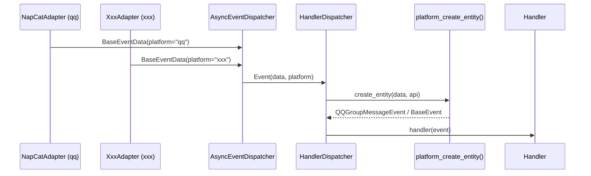

# 通信层与事件系统详解

> NapCat WebSocket 连接、OB11Protocol 请求-响应匹配、AsyncEventDispatcher 广播机制、多平台事件路由与 EventStream 的内部实现。

---

## 目录

- [1. NapCat WebSocket 对接](#1-napcat-websocket-对接)
- [2. OB11Protocol 序列号匹配](#2-ob11protocol-序列号匹配)
- [3. AsyncEventDispatcher 广播实现](#3-asynceventdispatcher-广播实现)
- [4. 多平台事件链路](#4-多平台事件链路)

---

## 1. NapCat WebSocket 对接

> 源码：`ncatbot/adapter/napcat/connection/websocket.py`

`NapCatWebSocket` 是最底层的通信组件，纯粹负责 WebSocket 连接建立、数据收发和断线重连。

### 1.1 连接建立流程

连接参数：`close_timeout=0.2s`、`max_size=2³⁰ (~1GB)`、`open_timeout=5s`。使用 `asyncio.Lock` 保护 `send()` 方法，防止并发写入导致帧交错。

### 1.2 消息帧格式

NapCat 使用 OneBot v11 正向 WebSocket 协议，所有消息均为 JSON 文本帧：

| 类型 | 特征 | 处理方式 |
|------|------|----------|
| API 响应 | 包含 `echo` 字段 | OB11Protocol 匹配 Future |
| 事件推送 | 不含 `echo`，含 `post_type` | 转发给 event_handler |

### 1.3 心跳与自动重连

依赖 NapCat 的 `meta_event.heartbeat` 推送判断连接存活。断线时使用指数退避重连：

| 常量 | 值 | 说明 |
|------|-----|------|
| `_MAX_RECONNECT_ATTEMPTS` | 5 | 最大重连次数 |
| `_RECONNECT_BASE_DELAY` | 1.0s | 初始退避延迟 |
| `_RECONNECT_MAX_DELAY` | 30.0s | 最大退避延迟 |

---

## 2. OB11Protocol 序列号匹配

> 源码：`ncatbot/adapter/napcat/connection/protocol.py`

`OB11Protocol` 使用 UUID echo 字段 + `asyncio.Future` 实现异步 API 调用的请求-响应配对。

---

## 3. AsyncEventDispatcher 广播实现

> 源码：`ncatbot/core/dispatcher/dispatcher.py`、`ncatbot/core/dispatcher/stream.py`

核心模式为**一个生产者对多个消费者**的广播分发。

### 3.1 asyncio.Queue 多消费者分发

每个 `events()` 调用创建一个 `EventStream`，注册一个 `asyncio.Queue`。事件到达时广播到所有活跃队列。

**背压策略**：队列默认大小 500，满时丢弃最旧事件。

**事件类型解析**：`_resolve_type()` 从 `BaseEventData` 推导点分格式事件类型。当 `notice_type == "notify"` 时进一步解析 `sub_type`。

### 3.2 EventStream 生命周期

`EventStream` 是异步可迭代对象，支持按类型前缀过滤：

| `event_type` 参数 | 匹配行为 |
|---|---|
| `EventType.MESSAGE` | 匹配 `"message"`、`"message.group"`、`"message.private"` |
| `"message.group"` | 只匹配 `"message.group"` 及其子类型 |
| `None` | 接收全部事件 |

### 3.3 close() 清理流程

1. 标记 `_closed = True` — 阻止新调用
2. 向所有队列写入 `_STOP` 哨兵 — 唤醒阻塞的 EventStream
3. 清空 `_stream_queues` — 释放队列
4. 对所有 waiter 设置异常 — 唤醒 `wait_event()` 调用方
5. 清空 `_waiters`

---

## 4. 多平台事件链路

> 5.2 新增

### 4.1 事件数据流

### 4.2 create_entity() 平台路由

`event.common.factory.create_entity()` 使用三级回退策略：

1. **平台工厂** — 查找 `_PLATFORM_FACTORIES[data.platform]`，平台模块通过 `register_platform_factory()` 注册
2. **遗留 QQ 工厂** — 如果平台工厂未匹配，回退到 `event.factory.create_entity()`（向后兼容）
3. **BaseEvent** — 兜底，返回只有 `data` 和 `api` 的 `BaseEvent`

### 4.3 HandlerDispatcher 平台感知

`HandlerDispatcher` 在 `_dispatch()` 中：
- 使用 `platform_create_entity()` 替代旧的 `create_entity()`
- 根据 `event.platform` 选择平台特定的 `IAPIClient` 注入到 `HookContext.api`
- `PlatformFilter` Hook 在 `BEFORE_CALL` 阶段检查 `event.platform`，不匹配则 `SKIP`

### 4.4 BotClient 多适配器编排

`BotClient` 通过 `adapters` 参数接收多个适配器：
- 检查 `platform` 唯一性（重复则 `ValueError`）
- 所有适配器共享同一个 `AsyncEventDispatcher`
- `_listen_forever()` 使用 `asyncio.gather()` 并行监听所有适配器
- `BotAPIClient` 为每个适配器注册平台 API，Handler 通过 `api.qq.xxx()` 或 `api.platform("xxx").xxx()` 访问

---

## 延伸阅读

- [适配器参考](../../reference/adapter/) — NapCatAdapter 完整 API
- [核心内部实现参考](../../reference/core/) — Dispatcher 完整接口
