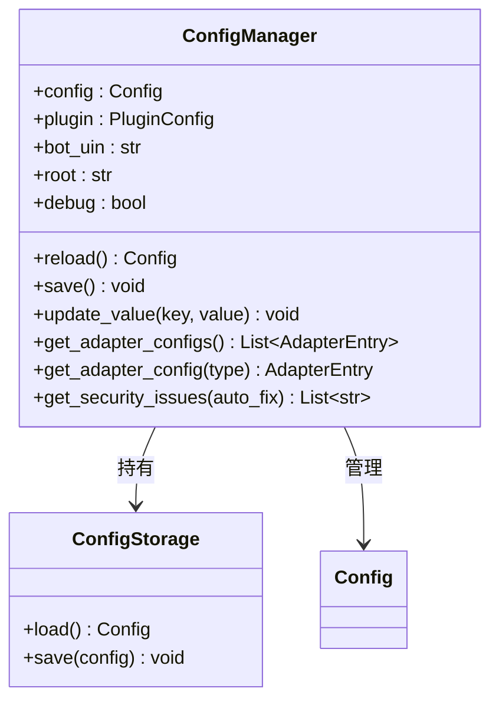

# ConfigManager 与配置安全

> `ConfigManager` 配置读写接口、`ConfigStorage` YAML 原子读写、以及安全工具。

---

## 目录

- [架构概览](#架构概览)
- [获取管理器](#获取管理器)
- [读取配置](#读取配置)
- [修改与保存](#修改与保存)
- [配置安全](#配置安全)
- [全局配置覆盖](#全局配置覆盖)

---

## 架构概览



---

## 获取管理器

```python
from ncatbot.utils import get_config_manager, ncatbot_config

manager = get_config_manager()                  # 全局单例
manager = get_config_manager("/path/to/config.yaml")  # 指定路径
print(ncatbot_config.bot_uin)                   # 便捷别名
```

---

## 读取配置

`ConfigManager` 使用**懒加载**——首次访问 `config` 属性时才从磁盘加载：

```python
manager = get_config_manager()
uin = manager.bot_uin                         # str
config: Config = manager.config               # 完整配置对象

# 读取适配器配置
entry = manager.get_adapter_config("napcat")  # AdapterEntry | None
if entry:
    ws_uri = entry.config.get("ws_uri", "ws://localhost:3001")
```

> **已弃用**：`manager.napcat` 属性仍可用，但会发出 `DeprecationWarning`，请迁移到 `get_adapter_config()`。

---

## 修改与保存

### update_value — 通用键值写入

支持直接键和嵌套点分键：

```python
manager.update_value("debug", True)
manager.save()
```

### 修改适配器配置

```python
entry = manager.get_adapter_config("napcat")
if entry:
    entry.config["ws_uri"] = "ws://192.168.1.100:3001"
    entry.config["ws_token"] = "my_strong_token"
    manager.save()
```

> **已弃用**：`update_napcat()` 仍可用，但会发出 `DeprecationWarning`。

### reload — 重新加载

```python
config = manager.reload()  # 从磁盘重新读取
```

---

## 配置安全

安全工具定义在 `ncatbot.utils.config.security` 模块中。

### strong_password_check

检查密码/令牌强度（≥12位、含大小写字母+数字+特殊字符）：

```python
from ncatbot.utils.config.security import strong_password_check
strong_password_check("Abc123!defgh")   # True
```

### generate_strong_token

```python
from ncatbot.utils.config.security import generate_strong_token
token = generate_strong_token()       # 16 位强令牌
token = generate_strong_token(32)     # 32 位强令牌
```

### 自动修复

`ConfigManager.get_security_issues(auto_fix=True)` 遍历所有 NapCat 类型适配器，检查 `ws_token` 和 `webui_token` 安全性：

- 当 `ws_listen_ip == "0.0.0.0"` 且 `ws_token` 强度不足时，`auto_fix=True` 会自动生成新令牌
- 当 `enable_webui=True` 且 `webui_token` 强度不足时，同样自动替换

---

## 全局配置覆盖

在 `config.yaml` 的 `plugin.plugin_configs` 节统一管理插件配置，优先级高于插件本地配置：

```yaml
plugin:
  plugin_configs:
    MyPlugin:
      api_key: sk-prod-xxxx
      max_retries: 10
```

---

## Bilibili 凭据管理

Bilibili 适配器支持**扫码登录**：当 config.yaml 中 `sessdata` 为空或凭据已过期时，启动时会自动弹出二维码。扫码成功后，`sessdata`、`bili_jct`、`dedeuserid`、`ac_time_value` 会自动写回 config.yaml 的 bilibili 适配器配置段。

```yaml
# 扫码登录后 config.yaml 自动更新为:
adapters:
  - type: bilibili
    config:
      sessdata: "<自动填入>"    # 扫码后自动写入
      bili_jct: "<自动填入>"
      dedeuserid: "<自动填入>"
      ac_time_value: "<自动填入>"
      live_rooms: [12345]
```

> **安全提示**：`sessdata` 等凭据等同于登录 Cookie，请勿泄露 config.yaml 文件。建议将 config.yaml 加入 `.gitignore`。

---

## 延伸阅读

- [CLI 配置管理](../cli/1.commands.md#配置管理) — config show / get / set 命令
- [配置/数据 Mixin](../plugin/5a.config-data.md) — 插件中的 ConfigMixin
- [配置参考](../../reference/utils/1a_config.md) — Config / AdapterEntry / NapCatConfig 完整字段
