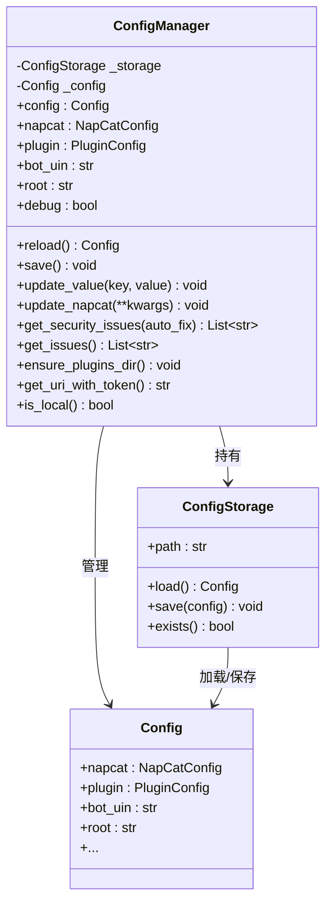
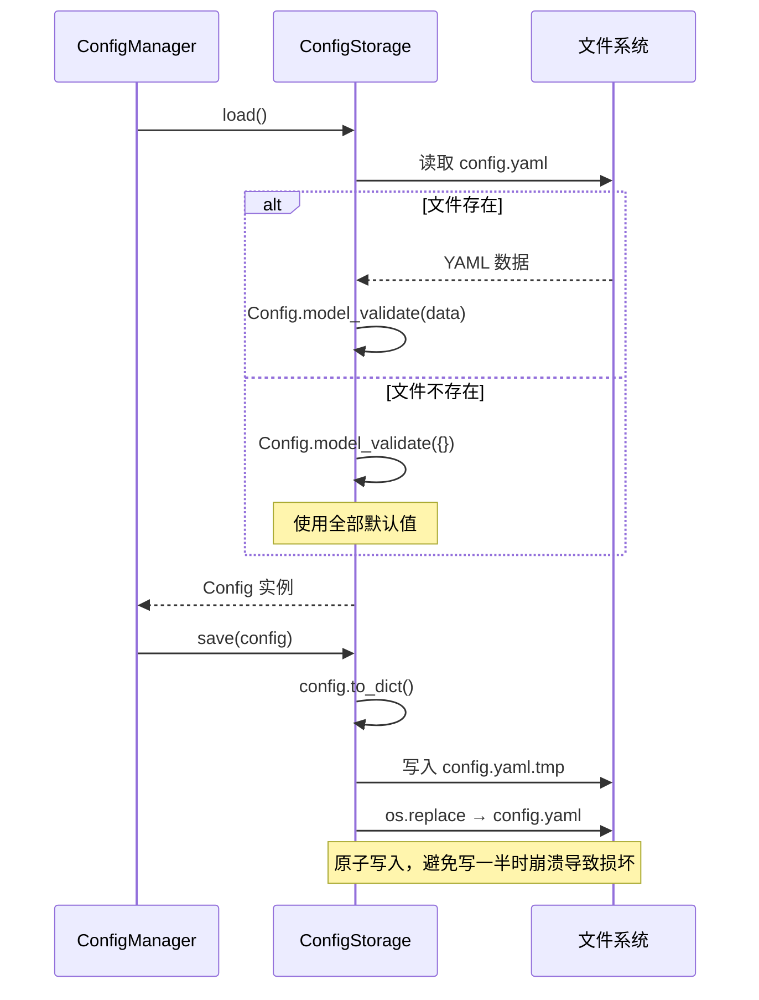

# ConfigManager 与 ConfigStorage

> `ConfigManager` 是配置系统的主要接口，`ConfigStorage` 负责 YAML 文件的原子读写。

---

## 架构概览



---

## 获取管理器

`ConfigManager` 定义在 `ncatbot.utils.config.manager` 模块中。通过 `get_config_manager()` 获取全局单例：

```python
from ncatbot.utils import get_config_manager

# 使用默认路径（当前目录的 config.yaml）
manager = get_config_manager()

# 指定配置文件路径
manager = get_config_manager("/path/to/config.yaml")
```

模块还导出了便捷别名 `ncatbot_config`：

```python
from ncatbot.utils import ncatbot_config

# 等价于 get_config_manager()
print(ncatbot_config.bot_uin)
```

---

## 读取配置

`ConfigManager` 使用**懒加载**机制 — 首次访问 `config` 属性时才从磁盘加载：

```python
manager = get_config_manager()

# 访问主配置
uin = manager.bot_uin          # str
is_debug = manager.debug       # bool

# 访问子配置
ws_uri = manager.napcat.ws_uri        # str
plugins_dir = manager.plugin.plugins_dir  # str

# 访问完整配置对象
config: Config = manager.config
```

---

## 修改与保存

### update_value — 通用键值写入

支持直接键和嵌套点分键。底层利用 `BaseConfig.get_field_paths()` 把短键（如 `ws_uri`）映射到完整路径（`napcat.ws_uri`）：

```python
manager = get_config_manager()

# 直接键
manager.update_value("debug", True)

# 嵌套键（自动解析到 napcat.ws_uri）
manager.update_value("ws_uri", "ws://192.168.1.100:3001")

# 完整点分路径
manager.update_value("napcat.ws_token", "new_token")

# 保存到文件
manager.save()
```

> `BaseConfig.get_field_paths()` 递归生成字段路径映射：
> ```python
> config = Config()
> config.get_field_paths()
> # {'bot_uin': 'bot_uin', 'napcat': 'napcat', 'ws_uri': 'napcat.ws_uri', ...}
> ```

### update_napcat — 批量更新 NapCat 配置

```python
manager.update_napcat(
    ws_uri="ws://192.168.1.100:3001",
    ws_token="my_strong_token",
)
manager.save()
```

### reload — 重新加载

```python
config = manager.reload()  # 从磁盘重新读取
```

### save — 持久化

```python
manager.save()  # 将当前内存配置写回 config.yaml
```

---

## 安全检查

```python
# 检查并自动修复安全问题
issues = manager.get_security_issues(auto_fix=True)

# 仅检查，不修复
issues = manager.get_security_issues(auto_fix=False)
# 可能返回: ["WS 令牌强度不足", "WebUI 令牌强度不足"]

# 获取所有问题（安全 + 必填项）
all_issues = manager.get_issues()
# 可能返回: ["机器人 QQ 号未配置", "管理员 QQ 号未配置"]
```

安全检查触发条件：

| 条件 | 检查内容 |
|---|---|
| `ws_listen_ip == "0.0.0.0"` | WS 令牌（`ws_token`）强度 |
| `enable_webui == True` | WebUI 令牌（`webui_token`）强度 |

> 安全工具详情参见 [配置安全](2_security.md)。

---

## 便捷方法

| 方法 | 返回类型 | 说明 |
|---|---|---|
| `get_uri_with_token()` | `str` | 返回带 token 的 WS URI：`ws://host:port?access_token=xxx` |
| `is_local()` | `bool` | WS 连接是否在本地（`localhost` / `127.0.0.1`） |
| `is_default_uin()` | `bool` | bot_uin 是否仍为默认值 `"123456"` |
| `is_default_root()` | `bool` | root 是否仍为默认值 `"123456"` |
| `ensure_plugins_dir()` | `None` | 确保插件目录存在，不存在则自动创建 |

---

## ConfigStorage

`ConfigStorage` 负责 YAML 文件的读写操作，定义在 `ncatbot.utils.config.storage` 模块中。

### 加载与保存机制



关键实现细节：

- **安全写入**：先写入 `.tmp` 临时文件，再通过 `os.replace()` 原子替换，避免写入中途崩溃导致文件损坏
- **懒加载**：`ConfigManager.config` 属性首次访问时才调用 `load()`
- **YAML 解析**：使用 `yaml.safe_load()`，不执行任何 Python 代码

### 配置文件路径

配置文件路径的确定优先级：

```
1. ConfigManager(path="/custom/path.yaml")   ← 代码指定
2. NCATBOT_CONFIG_PATH 环境变量              ← 环境变量
3. os.getcwd() + "/config.yaml"              ← 当前工作目录（默认）
```

```python
import os
from ncatbot.utils.config.storage import CONFIG_PATH

# CONFIG_PATH 的默认值
print(CONFIG_PATH)  # → /当前工作目录/config.yaml

# 通过环境变量覆盖
os.environ["NCATBOT_CONFIG_PATH"] = "/etc/ncatbot/config.yaml"
```
