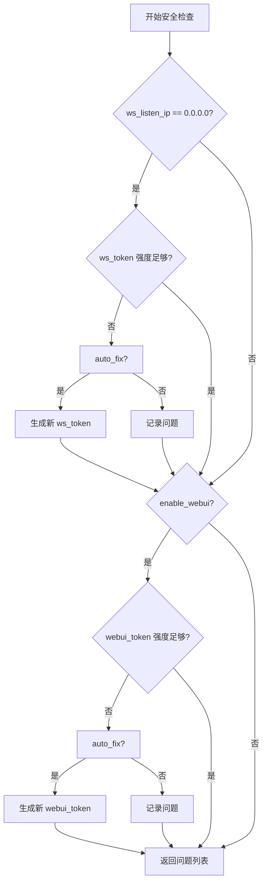

# 配置安全

> 安全工具定义在 `ncatbot.utils.config.security` 模块中，提供令牌强度检查、强令牌生成和自动修复机制。

---

## strong_password_check

```python
def strong_password_check(password: str) -> bool
```

检查密码/令牌是否满足强度要求：

| 规则 | 要求 |
|---|---|
| 最小长度 | ≥ 12 位 |
| 数字 | 至少包含 1 个数字 |
| 小写字母 | 至少包含 1 个小写字母 |
| 大写字母 | 至少包含 1 个大写字母 |
| 特殊符号 | 至少包含 1 个 URI 安全特殊字符 |

允许的特殊字符（`URI_SPECIAL_CHARS`）：`-_.~!()*`

```python
from ncatbot.utils.config.security import strong_password_check

strong_password_check("weak")           # False — 太短
strong_password_check("abcdefghijkl")   # False — 缺少大写/数字/特殊字符
strong_password_check("Abc123!defgh")   # True
```

---

## generate_strong_token

```python
def generate_strong_token(length: int = 16) -> str
```

生成满足 `strong_password_check` 要求的随机令牌。字符集包括大小写字母、数字和 `URI_SPECIAL_CHARS`。

```python
from ncatbot.utils.config.security import generate_strong_token

token = generate_strong_token()       # 16 位强令牌
token = generate_strong_token(32)     # 32 位强令牌
```

---

## 自动修复流程

`ConfigManager.get_security_issues(auto_fix=True)` 的检查与修复流程：



> **安全建议**：当 `ws_listen_ip` 设置为 `0.0.0.0`（监听所有网卡）时，务必使用高强度令牌。框架会在启动时自动检测并替换弱令牌。

---

## 全局配置覆盖

运维人员可在全局 `config.yaml` 的 `plugin.plugin_configs` 节统一管理插件配置，无需修改每个插件的配置文件。全局配置覆盖的优先级**高于**插件本地配置：

```yaml
# 项目根目录 config.yaml
plugin:
  plugin_configs:
    MyPlugin:
      api_key: sk-prod-xxxx
      max_retries: 10
```

覆盖在 `_mixin_load()` 中通过 `_apply_global_overrides()` 执行：

```python
def _apply_global_overrides(self) -> None:
    """读取全局 plugin.plugin_configs 中本插件的条目，覆盖 self.config。"""
    overrides = get_config_manager().config.plugin.plugin_configs.get(self.name)
    if overrides:
        self.config.update(overrides)
```

---

## 插件配置存储位置

插件配置文件路径为：

```
{workspace}/{plugin_name}/config.yaml
```

其中 `workspace` 通常是插件目录。例如，插件 `MyPlugin` 的配置文件位于：

```
plugins/MyPlugin/config.yaml
```

---

## 运维部署配置

适用于生产部署的配置模板，包含安全加固建议：

```yaml
# config.yaml — 生产环境模板
bot_uin: '1234567890'        # ← 必须修改为真实 QQ 号
root: '9876543210'           # ← 必须修改为管理员 QQ 号
debug: false
enable_webui_interaction: true
check_ncatbot_update: true
skip_ncatbot_install_check: false
websocket_timeout: 30        # 生产环境建议增大超时

napcat:
  ws_uri: ws://localhost:3001
  ws_token: 'A1b2C3d4!e5F6g7H'   # ← 至少 12 位，包含大小写+数字+特殊字符
  ws_listen_ip: localhost          # ← 生产环境不建议设为 0.0.0.0
  webui_uri: http://localhost:6099
  webui_token: 'X9y8Z7w6~v5U4t3S' # ← 至少 12 位强令牌
  enable_webui: true
  stop_napcat: false
  skip_setup: false

plugin:
  plugins_dir: plugins
  load_plugin: true
  auto_install_pip_deps: true
  plugin_whitelist: []             # 生产环境可限制只加载指定插件
  plugin_blacklist: []
  plugin_configs:                  # 统一管理所有插件配置
    WeatherPlugin:
      api_key: sk-production-key
```

启动前可通过代码验证配置：

```python
from ncatbot.utils import get_config_manager

manager = get_config_manager()
issues = manager.get_issues()
if issues:
    print("配置存在以下问题：")
    for issue in issues:
        print(f"  - {issue}")
else:
    print("配置检查通过")
```
