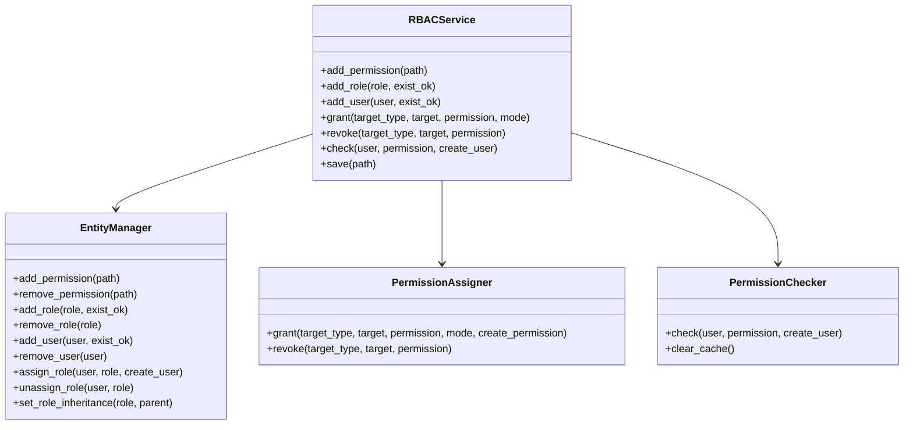
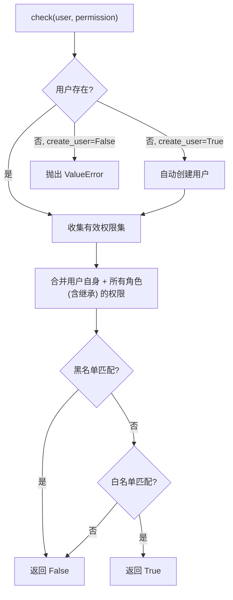

# RBAC 核心模块与插件集成

> EntityManager / PermissionAssigner / PermissionChecker 核心模块详解与 RBACMixin 插件集成示例。

---

## 目录

- [1. 核心模块](#1-核心模块)
  - [1.1 实体管理（EntityManager）](#11-实体管理entitymanager)
  - [1.2 权限分配（PermissionAssigner）](#12-权限分配permissionassigner)
  - [1.3 权限检查（PermissionChecker）](#13-权限检查permissionchecker)
- [2. 插件集成：RBACMixin](#2-插件集成rbacmixin)

---

## 1. 核心模块

NcatBot 的 RBAC 由四个核心模块组成：



### 1.1 实体管理（EntityManager）

`EntityManager` 负责管理三类实体——权限、角色、用户。

**权限管理：**

```python
entity_manager.add_permission("my_plugin.admin")
entity_manager.permission_exists("my_plugin.admin")  # True
entity_manager.remove_permission("my_plugin.admin")
```

**角色管理：**

```python
entity_manager.add_role("admin")
entity_manager.add_role("admin", exist_ok=True)  # 已存在时不报错

entity_manager.set_role_inheritance("admin", "user")  # admin 继承 user 的权限

entity_manager.remove_role("admin")  # 同时清理关联的用户和继承关系
```

**用户管理：**

```python
entity_manager.add_user("12345678")
entity_manager.assign_role("12345678", "admin", create_user=True)
entity_manager.user_has_role("12345678", "admin")  # True
entity_manager.unassign_role("12345678", "admin")
entity_manager.remove_user("12345678")
```

### 1.2 权限分配（PermissionAssigner）

`PermissionAssigner` 负责向用户或角色授予/撤销权限。

**`grant` 方法签名：**

```python
def grant(
    self,
    target_type: Literal["user", "role"],       # 目标类型
    target: str,                                 # 用户 ID 或角色名
    permission: str,                             # 权限路径
    mode: Literal["white", "black"] = "white",   # 白名单(授予) 或 黑名单(拒绝)
    create_permission: bool = True,              # 权限不存在时是否自动创建
) -> None
```

**`revoke` 方法签名：**

```python
def revoke(
    self,
    target_type: Literal["user", "role"],  # 目标类型
    target: str,                            # 用户 ID 或角色名
    permission: str,                        # 权限路径
) -> None
```

关键行为：

- `mode="white"` 将权限加入白名单，同时从黑名单中移除
- `mode="black"` 将权限加入黑名单，同时从白名单中移除
- `revoke` 同时从白名单和黑名单中移除该权限

### 1.3 权限检查（PermissionChecker）

**`check` 方法签名：**

```python
def check(
    self,
    user: str,                 # 用户 ID
    permission: str,           # 权限路径
    create_user: bool = True,  # 用户不存在时是否自动创建
) -> bool
```

**检查流程：**



**有效权限集的计算**（`_get_effective_permissions`）：

1. 获取用户自身的白名单和黑名单
2. 递归收集用户所有角色（含继承的父角色）
3. 合并所有角色的白名单和黑名单
4. 返回最终的 `{whitelist: frozenset, blacklist: frozenset}`

> **性能优化**：`_get_effective_permissions` 使用 `@lru_cache(maxsize=256)` 缓存结果。当权限数据变更时，系统会自动调用 `clear_cache()` 清除缓存。

---

## 2. 插件集成：RBACMixin

完整插件示例——注册权限、创建角色、运行时授权与检查：

```python
from ncatbot.core import registrar
from ncatbot.event import GroupMessageEvent
from ncatbot.plugin import NcatBotPlugin
from ncatbot.types import At


class MyPlugin(NcatBotPlugin):
    name = "my_plugin"
    version = "1.0.0"

    async def on_load(self):
        # 1. 注册权限路径
        self.add_permission("my_plugin.admin")
        self.add_permission("my_plugin.user")

        # 2. 创建角色
        self.add_role("my_plugin_admin", exist_ok=True)
        self.add_role("my_plugin_user", exist_ok=True)

        # 3. 给角色分配权限
        if self.rbac:
            self.rbac.grant("role", "my_plugin_admin", "my_plugin.admin")
            self.rbac.grant("role", "my_plugin_admin", "my_plugin.user")
            self.rbac.grant("role", "my_plugin_user", "my_plugin.user")

    @registrar.on_group_command("授权")
    async def on_grant(self, event: GroupMessageEvent, target: At = None):
        """授予目标用户管理员角色"""
        if target is None:
            await event.reply("请 @一个用户")
            return
        target_uid = str(target.qq)
        if self.rbac:
            self.rbac.assign_role("user", target_uid, "my_plugin_admin")
            await event.reply(f"已授予用户 {target_uid} 管理员权限")

    @registrar.on_group_command("撤权")
    async def on_revoke(self, event: GroupMessageEvent, target: At = None):
        """移除目标用户管理员角色"""
        if target is None:
            await event.reply("请 @一个用户")
            return
        target_uid = str(target.qq)
        if self.rbac:
            self.rbac.unassign_role("user", target_uid, "my_plugin_admin")
            await event.reply(f"已移除用户 {target_uid} 的管理员权限")

    @registrar.on_group_command("管理命令")
    async def on_admin_cmd(self, event: GroupMessageEvent):
        """受权限保护的命令"""
        uid = str(event.user_id)
        if self.check_permission(uid, "my_plugin.admin"):
            await event.reply("管理命令执行成功")
        else:
            await event.reply("你没有执行此命令的权限")

    @registrar.on_group_command("查权限")
    async def on_check(self, event: GroupMessageEvent):
        """查看自己的权限状态"""
        uid = str(event.user_id)
        has_admin = self.check_permission(uid, "my_plugin.admin")
        has_user = self.check_permission(uid, "my_plugin.user")
        is_admin = self.user_has_role(uid, "my_plugin_admin")

        await event.reply(
            f"角色 my_plugin_admin: {'✅' if is_admin else '❌'}\n"
            f"权限 my_plugin.admin: {'✅' if has_admin else '❌'}\n"
            f"权限 my_plugin.user: {'✅' if has_user else '❌'}"
        )
```

---

> **下一篇**：[RBACService API 与高级用法](2b_integration.md) · **返回**：[RBAC 权限管理](README.md)
